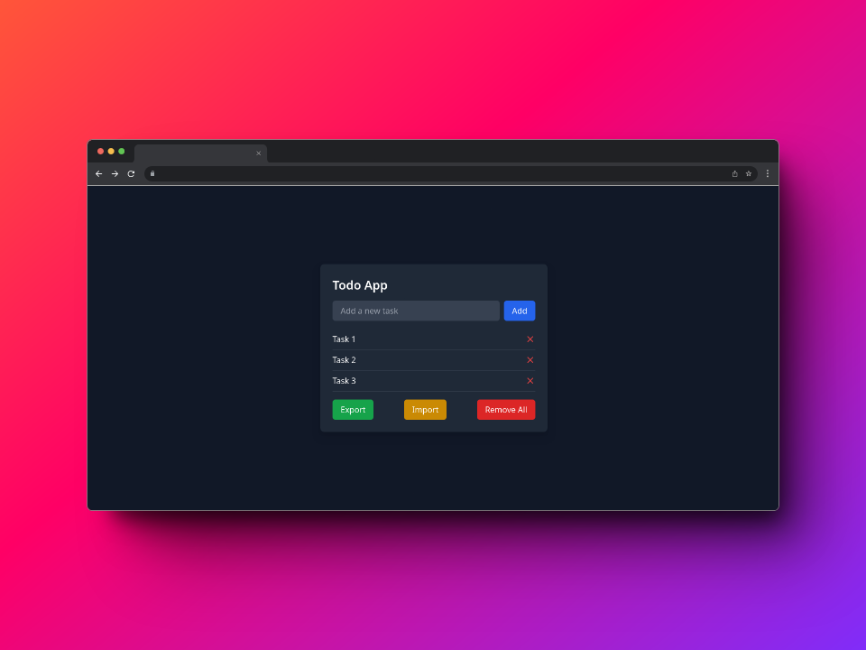

# React Todo App

This is a simple Todo App built using React as a learning project. It allows you to add tasks, remove tasks, remove all tasks, import tasks, and export tasks.

## Demo

A live version of the app is deployed [here](https://react-todo.thevaibhavway.pro/) which is hosted on Cloudflare Pages.


## Features

- **Add Tasks:** You can add new tasks to the todo list.
- **Remove Tasks:** You can remove individual tasks from the todo list.
- **Remove All:** You can remove all tasks from the todo list.
- **Import:** You can import tasks from a [JSON file](#json-file-format).
- **Export:** You can export tasks to a [JSON file](#json-file-format).

## Installation

To run the app locally, follow these steps:

1. Clone the repository: `git clone https://github.com/VaibhavSys/react-todo-app.git`
1. Navigate to the project directory: `cd react-todo-app`
1. Install the dependencies: `npm install`
1. Start the development server: `npm run dev`
1. Open your browser and visit [http://localhost:5173](http://localhost:5173)

## JSON File Format

To import tasks into the web app, the file must be formatted in JSON format and contain an array of strings.

For example:

```json
["Task 1", "Task 2", "Task 3"]
```

## License

This project is licensed under the [MIT License](LICENSE).
